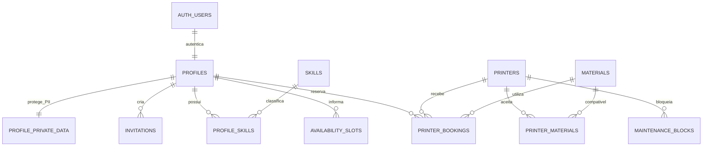

# Seguranca e operacao do banco

Este documento e o mapa de revisao do banco do MVP. As migrations em
`supabase/migrations` sao a fonte executavel; `DATABASE_SCHEMA.md` descreve o dominio.

## Mapa do banco



`profiles` contem somente dados usados no diretorio interno autenticado. CPF, RG,
nascimento e endereco ficam em `profile_private_data`. Idiomas e proficiencia estao
fora do MVP e nao possuem tabelas nesta versao.

## Matriz de permissoes

| Recurso | Anonimo | Sem perfil/inativo | Pesquisador ativo | Coordenador ativo |
| --- | --- | --- | --- | --- |
| Diretorio de perfis | Nao | Nao | Leitura | Leitura e administracao |
| Dados privados | Nao | Somente o proprio registro | Somente o proprio registro | Leitura para suporte administrativo |
| Habilidades proprias | Nao | Nao | Leitura e edicao propria | Administracao |
| Disponibilidade | Nao | Nao | Leitura e edicao propria via RPC | Administracao via RPC |
| Impressoras/materiais | Nao | Nao | Leitura | Administracao |
| Reservas | Nao | Nao | Leitura, criacao, edicao e cancelamento proprio via RPC | Edicao, cancelamento e ciclo operacional via RPC |
| Manutencao | Nao | Nao | Leitura | Criacao/remocao via RPC |
| Aviso de privacidade | Leitura minima | Leitura minima | Leitura minima | Leitura minima |
| Convites | Nao | Nao | Nao | Edge Functions e leitura de auditoria |
| Configuração de funcionamento | Leitura | Leitura | Gestão por RPC | Capacidade, turnos e intervalos validados transacionalmente |

As escritas em `availability_slots` são realizadas pela RPC `replace_profile_availability`.
Ela serializa alterações concorrentes, valida dias/turnos ativos e impede ocupação presencial
acima de `workspace_capacity`.

As RPCs `save_lab_schedule_period` e `update_lab_breaks` compartilham um bloqueio transacional e
impedem sobreposição entre turnos ativos e os intervalos configuráveis de almoço e jantar.

RLS continua sendo aplicada quando o navegador chama a Data API diretamente. Operacoes
que alteram varias linhas ou validam concorrencia sao expostas somente como funcoes transacionais.

## Revisao de minimizacao de dados

O diretorio autenticado expoe apenas os campos usados na operacao do laboratorio: nome, email,
papel, vinculo, fomento, carga horaria, Lattes, nacionalidade, telefone e bio. Nascimento,
CPF, RG e endereco permanecem em `profile_private_data`, legiveis somente pelo titular e por
coordenadores para suporte administrativo. Nenhum desses campos e exposto anonimamente.

Antes da producao, o responsavel institucional deve registrar aceite explicito para:

1. necessidade de telefone, nacionalidade e informacoes de fomento no diretorio compartilhado;
2. necessidade de coordenadores lerem documentos e endereco;
3. prazo de retencao e processo de correcao/exclusao desses dados;
4. texto do aviso de privacidade e contato institucional configurado;
5. uso de dados reais somente depois da validacao em staging.

O frontend aceita redirecionamento pos-login apenas para caminhos internos sem barras invertidas.
Essa validacao reduz o risco de redirecionamento aberto enquanto o projeto permanece no React
Router 6. A atualizacao para React Router 7 deve ser tratada separadamente, pois e uma migracao
incompativel; o projeto nao usa hidratacao SSR, relacionada ao segundo alerta moderado conhecido.

## Fluxo de convite

1. Um coordenador autenticado chama a Edge Function `invite-user`.
2. A funcao valida o JWT e o papel no banco usando o cliente administrativo.
3. Ela exige contato institucional de privacidade, valida o papel solicitado, cria uma linha
   `pending` com validade de 72 horas e usa o Supabase Auth para enviar o email.
4. O template aponta para uma pagina intermediaria. Abertura ou pre-carga nao consome o token;
   somente o botao de aceite chama `verifyOtp` e registra `opened_at`.
5. O usuario autenticado chama `create_profile`; a funcao usa `auth.uid()`, o email do JWT e o papel
   armazenado no convite, sem aceitar o papel enviado pelo navegador durante o cadastro.
6. Perfil publico, dados privados e consumo do convite acontecem na mesma transacao. O email
   duplicado e removido de `invitations`.
7. `manage-invitation` invalida o usuario Auth anterior antes de reenviar ou revogar. Reenvios tem
   intervalo minimo de cinco minutos.
8. O Cron chama `cleanup-invitations` a cada hora. Ele anonimiza expirados e repete de forma
   idempotente a exclusao definitiva de identidades incompletas.

Segredos `SUPABASE_SERVICE_ROLE_KEY` nunca pertencem ao frontend. Configure na Edge Function
`PUBLIC_SITE_URL`. O bearer do Cron e a URL da funcao ficam criptografados no Supabase Vault. No
projeto hospedado, mantenha cadastro publico desabilitado em Auth.

## Aplicar e validar

Requisitos: Docker e Supabase CLI.

```bash
supabase start
supabase db reset
supabase test db
npm test
npm run build
```

O reset recria um banco local vazio e aplica todas as migrations em ordem. Para atualizar os
tipos depois de alterar o schema, execute `npm run db:types` e revise o diff gerado.

## Publicacao e recuperacao

1. Gere backup do banco remoto antes de aplicar a migration.
2. Valide a migration em um projeto Supabase de staging recriado do zero.
3. Aplique com `supabase db push` apenas depois do CI verde.
4. Publique as Edge Functions `invite-user`, `manage-invitation` e `cleanup-invitations`, configure
   `PUBLIC_SITE_URL`, o template com `TokenHash` e o Cron.
5. Teste convite, cadastro, perfil privado e duas reservas conflitantes em staging.

Migrations aplicadas nao devem ser editadas. Se houver falha antes do commit da migration, o
PostgreSQL desfaz a transacao. Depois da publicacao, crie uma migration compensatoria. Para perda
ou corrupcao, restaure o backup em um projeto separado e valide antes de promover a restauracao.

## Primeiro coordenador

Em ambiente totalmente vazio, o primeiro coordenador deve ser criado por `setup:local` ou
`bootstrap:remote`, nunca pelo navegador. Depois do login, ele conclui o wizard transacional do
laboratorio. Os demais usuarios entram por convite.

O MVP possui uma baseline consolidada. Depois que ela for publicada na `main`, nao deve ser
reescrita: correcoes futuras entram como migrations incrementais novas.
